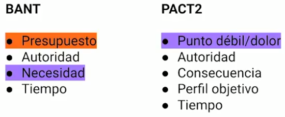

# SALESFORCE

[Version en notion](https://www.notion.so/SALESFORCE-9d1a8da228e5435eac90849abc3d9c30) 

Salesforce is a CRM (customer relationship management. Toda la gestión de la relación con nuestros clientes). It is a tool that makes businesses more efficient. It takes all the processes (finding new leads and prospects, selling it or turning it into customers, and making sure that they are happy with the products and services they’ve gotten).

Salesforce is about taking businesses that otherwise need thousand of employees and taking those and streamlining them to the point where not only can they operate more efficiently from a resource standpoint, but they can scale their business bigger and bigger with a **backend tool like salesforce that makes everything more efficient.**

### Terminología

- Objeto: las pestañas de mi hoja de cálculo
- Campo: las columnas de la hoja de cálculo.
- Registro: las filas de la hoja de cálculo.

### Principales objetos

- Candidato: Esta opción es completamente voluntaria. Se puede llamar prospecto o cliente potencial y cuando se convierte se crea un:
    - Contacto. Hace referencia a la persona
    - Cuenta. Hace referencia a la empresa
    - Oportunidad. Hace referencia al negocio. Reflejan el proceso de ventas.

### Qué se puede hacer con salesforce

- Crear candidatos nuevos
- Actualizar información de candidatos
- Cambiar el estado de los candidatos. Cada etapa tiene campos claves que es una ayuda que da salesforce para entender que campos nececitamos tener de ese candidato para ir avanzando en las etapas. Las etapas son
    - Unqualified
    - Nuevo
    - Working
    - Nurturing
    - Convertido
    
    También aparece un texto que es una orientación para ayudar a los vendedores o a quien está calificando el candidato a saber que información o qué debería pasar en cada una de estas etapas.
    
- Administrar las actividades, que van a estar relacionadas a todos los objetos que tenemos en nuestro CRM. Todo el trabajo que se haga con el cliente debe quedar registrado como una actividad. Es muy importante centralizar los datos en una sola herramienta.
    - Registrar llamadas
    - Tarea: algo que pones en una fecha a futuro. Puede ser una tarea de seguimiento, por ejemplo.
    - Evento: es algo que pones en una fecha a futuro con una fecha de fin y una de inicio.
    - Enviar correo electrónico. También se puede conectar tu proveedor de preferencia pero depende.

### ¿Cuando debería convertir un candidato?

Hay que someter al candidato por un proceso de calificación. Hay 2 procesos normalmente usados en el mercado:

- BANT (Budget, Authority, Need, Time). Vamos a evaluar bajo estas 4 variables si el candidato podría ser un cliente nuestro y con el que se puede iniciar el proceso de ventas. Pasar al candidato si cumple con al menos 2 de estas 4 variables:
    - Budget
    - Authority
    - Need
    - Time
- PACT/PACT2: Este proceso se enfoca más en el dolor.
    - Pain. Dolor o punto débil.
    - Authority
    - Consequence. Qué pasaría si el cliente no contrata mis servicios o adquiere mi producto
    - Target profile. Perfil objetivo. Si cumple con alguno de los requisitos de lo que es un cliente potencial para mi.
    - Time

### Objeto oportunidades

Este contiene:

- Objetos destacados como nombre de cuenta, importe, propietario de la cuenta
- Etapas de venta. Normalmente se conocen como embudo o pipeline de ventas. Al igual que las etapas de los candidatos esta permite ver qué tan avanzada está una oportunidad y que tan cercana al cierre está.
    - Podemos cerrar la oportunidad como closed won o closed lost
- Sección de actividades. Las actividades que tenía cuando era candidato se van a migrar a los objetos que he creado
- Chatter. Es una opción que permite colaborar internamente con el equipo.

### Objeto cuenta y contacto

En contactos vamos a tener toda la información de esta persona, y relacionada la empresea, correo y teléfono del propietario en campos destacados. Lo primero que nos va a mostrar salesforce es a qué otros objetos está relacionado este contacto y las oportunidades. En la parte derecha vemos las tareas y actividades que se migraron de este candidato cuando lo convertí.

En la cuenta vemos toda la información relacionada a la cuenta en específico. Es información relacionada a la persona.

Recuerda siempre modificar los datos y tener un proceso muy claro para que no te falte información en tu CRM.

Es muy importante identificar el modelo de negocio de tu empresa, ejemplo:

- B2C: Business to consumer. Lo más probable es que nos enfoquemos en el módulo o objeto de contactos, ya que será tu cliente final.
- B2B: Business to Business. Es mucho más común centrarnos en la información de las cuentas, pero no dejar de lado los contactos porque al final le vendemos a personas.

## ANÁLISIS DE LA INFORMACIÓN

Hay dos tipos de listas: vistas de listas y lista kanvan

### Vistas de listas

Salesforce me permite tener la opción de vistas de listas en cada una de los objetos

Esta vista de lista tiene varias ventajas:

- Puedo anclar la vista de lista y cada vez que entremos la podemos ver
- Podemos editar desde la lista la información con el lapiz que aparece al lado de cada uno de los campos y registros

**Pasos para crear una lista personalizada que nos permita tomar decisiones mucho más sencillo:**

1. Identificar las vistas que ya están creadas
    
    
    
2. Creamos una nueva lista
    
    
    
    - Para el nombre es importante saber qué tipo de información quiero que se vea
3. Hacemos los filtros necesarios
4. guardar
- Podemos organizar, agregar o quitar los campos que queramos
    
    
    

### Lista kanvan

Tiene varias ventajas:

- mucho más gráfica
- Me muestra todas las etapas de mi oportunidad
- no solo me agrupa por las etapas sino que me cuenta cuantas oportunidades hay en cada etapa y cual es el valor total o suma de todas estas etapas para tener un control mucho más claro de los números y metas.
- también podemos modificar la información y además podemos modificar las etapas de esta vista simplemento arrastrando una oportunidad de un lado a otro y se calcula automáticamente la etapa y el monto; así que vamos a estar actualizando mucho más rápido todas las oportunidades.
- También podemos fijar

### Informes

Podemos crear un reporte o gráfico mucho más sencillo desde la vista de lista, con esto vemos un gráfico predeterminado que muestra las opciones de los datos que ya he filtrado anteriormente en mi lista.

Para llegar a la sección de informes vamos a la barra de navegación > clic en Informes. Salesforce tiene muchos informes predeterminados que puedes usar si es util para tu modelo de negocio.

**Pasos para crear un informe desde cero:**

1. Barra de navegación > informes > nuevo informe. Esto abre una pestaña donde salesforce me pide entender de donde va a sacar la información para analizar los datos. Es preferible que sobren datos a que hagan falta.
    1. Siempre es bueno iniciar con la opción “Oportunidades con Productos” o “Oportunidades”.
2. Se abre una nueva ventana que contiene:
    - En la parte del medio una vista previa de los datos que no me dice la realidad (debemos ejecutar el reporte para ver los datos de la realidad).
    - En la parte izquierda está el esquema que me muestra cómo voy a organizar los datos; y la opción de filtros (la recomendación es empezar con la opción de filtros tanto para los reportes ya creados como los nuevos)
    - En la parte lateral izquierda hay una zona llamada campos, donde nos muestra todos los campos disponibles y el tipo de campo. Dependiendo del tipo de campo podemos tomar información para hacer un análisis diferente.
3. Podemos pasar a crear gráficos. Para crear la opción de gráficos debemos:
    1. agrupar la información por filas o columnas. Para agrupar la información solo podemos agregar 3 campos.
    2. Una vez agrupada una fila, sale la opción de agrupar columnas
    3. Salesforce me agrega 2 tablas diferentes:
        1. Una vista previa de la información agrupada
        2. Detalle de la información
4. Creamos gráfico. Le damos clic en Añadir gráfico para ver las opciones que nos ofrece salesforce. Desde la configuración del gráfico podemos ver todos los tipos de gráficos que podría agregar a este reporte. 
    - En la parte de abajo siempre es importante revisar como está organizando la información el gráfico.
    - Ponerle un título al gráfico es opcional pero muy recomendado.
    - El gráfico se ve pequeño porque estamos en la vista preliminar, pero cuando ejecutemos el informe vamos a poder verlo mucho más grande.
5. Ya podemos ejecutar el reporte para ver como se ve mucho más detallado. Hay 2 formas de hacerlo:
    - En el botón ejecutar. Si te sales de la vista vas a perder todo lo que acabas de hacer.
    - En el botón guardar y ejecutar. Va a pedir un nombre, y es importante que sean nombres claros y útiles para ti u otra persona que quiera consultar la información. También es muy recomendable usar la opción de drescripción del informe para poder consultar el detalle del reporte que ya creaste.
    - Es de buena práctica agrupar por temas

### Panel personalizado

Esta opción nos permite agrupar y ver de forma visual diferentes tipos de informes.

Como crear un panel personalizado: se puede hacer desde el objeto de paneles o desde el mismo reporte

1. Le damos en modificar nuestro informe > agregar a panel
    
    
    
    Esto nos cambia de pestaña informes a paneles. 
    
2. Le damos en crear. Una vez estando en el panel ya creado, lo primero que va a abrir es la opción de componente. El componente es el nuevo gráfico que voy a agregar y va a traer del reporte que acabo de tomar para crear este panel. Si no se ha creado un gráfico antes, en la opción de componente se puede hacer.
3. Clic en agregar.
4. El panel nos muestra una cuadrícula que nos va a permitir mover y organizar el objeto que acabo de agregar, y aumentar o disminuir el tamaño.
5. Le damos clic en guardar y clic en listo.
- Podemos agregar más componentes adicionales en la opción “+componente”
- Podemos crear diferentes tipo de gráficos en mi panel con un mismo reporte; esto me permitirá optimizar el manejo de los informes que estoy creando.

Podemos crear un filtro adicional para todo el panel que nos permita organizar toda la información para cada uno de los reportes que tengo disponibles.

1. Clic en modificar

1. Clic en la opción “+filtro”. Este filtro se va a agregar a todo el panel (cada uno de los componentes de los reportes que están dentro de este panel se van a filtrar por esta opción).
2. Clic en guardar y clic en listo.

## EXTENSIONES Y APLICACIONES

Salesforce maneja varias extensiones y aplicaciones que te pueden ayudar a hacer tu trabajo mucho más fácil.

- [appexchange]([https://appexchange.salesforce.com/](https://appexchange.salesforce.com/)): es un módulo donde salesforce comenta con qué diferentes aplicaciones se puede conectar e integrar para mejor el uso de la plataforma.
- [Trailhead]([https://trailhead.salesforce.com/es-MX](https://trailhead.salesforce.com/es-MX)): Comunidad de Salesforce donde capacita constantemente la plataforma. Sirve para resolver dudas adicionales y nuevas.